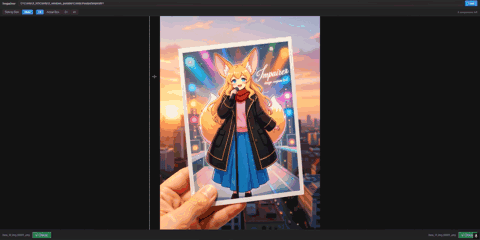
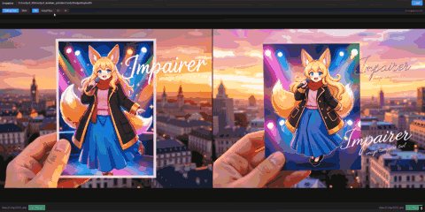

# Impairer — Image Compare Tool

A browser-based image comparison tool that lets you pick the best image from a folder of images through a tournament-style bracket. Supports side-by-side and slider comparison modes with multiple zoom levels.






## Download

**No Python install required.** Grab the latest release from the [Releases page](https://github.com/bossovichdon/Impairer/releases) — just double-click it and a browser tab opens automatically.

## Usage

1. Paste a folder path containing images (JPG, PNG, WEBP).
2. Compare images side-by-side or with the slider overlay.
3. Click **Choose** on the image you prefer — the other image is replaced by the next in line.
4. After all comparisons are done, the winning filename is displayed.

## Requirements

- Python 3.8+

## Quick Start (Windows)

1. Double-click **run.bat**

That's it. On the first run it will automatically create a virtual environment and install dependencies. A browser tab will open at `http://127.0.0.1:5000`.

## Manual Setup

```bash
python -m venv venv
venv\Scripts\activate      # Windows
source venv/bin/activate   # macOS / Linux

pip install -r requirements.txt
python app.py
```

Then open `http://127.0.0.1:5000` in your browser.

## Standalone Executable (no Python needed)

To build a single portable `.exe`:

```bash
build.bat
```

This creates `dist\Impairer.exe`. Distribute that file — recipients just double-click it and a browser tab opens automatically. No Python install required.
